==================================

Project: Camera Calibration and Fundamental Matrix Estimation with RANSAC
------------------------------------------------------------------------------

Figure 1: Epipolar lines using Normalized points and RANSAC

  The goal of this project is an introduction to camera and geometry
of the scene. We are required to solve the algorithm for camera
projection matrix along with the fundamental matrix estimation. Given
the task of finding the projection matrix and fundamental matrix
estimation this project can be sub divided in three categories:

I will briefly touch on each of the subcategory and algorithm I used to
perform each of sub task.

### **Step I**: Approximating fundamental matrix and camera centre {#L1}

   The first step of this project is to find the 3-D world to 2-D
transformation. We have 2-D image position and 3-D camera position.
Fundamental matrix is nothing but the relation between the 3-D mapping
to the 2-D scene. The homogeneous coordinates of the equation for
mapping from 3-D real world scene to 2-D camera coordinates is shown
below:

In above equation u and v represents the 2-D image points, whereas the
X, Y, and Z are the real-world points to be projected into 2-D (u,v). We
need to fix the scale for the matrix and get the final expression in
form of **AX = B**. We can find **u** and **v** from above matrix by
dividing first two rows by third row. The next expression will be:

Which can be further simplified as:

As we want to **fix the scale** for the matrix, we assign **m\_34** as
**1**. One solution can be m matrix to be 0, but that is not the useful
solution. The other way to do this is to decompose the matrix into its
singular components. The matrix form of **AX=B** will take the form of
below matrix. In the below matrix m\_34 is 1.

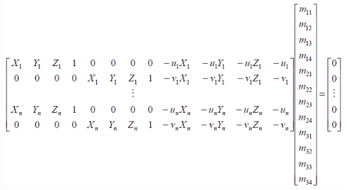

This matrix can be solved by solving **X= A-1B**. The 11x1 matrix of m
can be reshaped to get the final output of shape 3x4. The centre of
camera can be found using **C =inverse(Q)m\_4** which can be understand
as **M=(Q|m\_4)**. This means m\_4 and Q are part of M matrix we already
calculated. The last column of M represents m\_4 and first three columns
represent Q resulting m\_4’s shape to be 3x1 and for Q to be of 3x3
dimension. The below code routine help us calculating the **M** matrix:

    3-D to 2-D projection matrix estimation
    #This routine finds the M matrix that translates the 3-D scence to 2-D corresspondance

        ###########################################################################
        ###########################################################################
        
        A=np.zeros((int(2*points_3d.shape[0]),12))# Intializing A matrix with zeros 
        row=0    #intialize row
        for i in range(0,points_3d.shape[0]):#run for all points
            
            # The below code compute the values in A matrix
            
            A[row,0:3]=points_3d[i,:] # Updating X1 Y1 Z1 
            A[row,3]=1 # updating A(row,3) 4th column of A which has value 1
            A[row,8:11]=-points_2d[i,0]*points_3d[i,:] # -ui*Xi -ui*Yi -ui*Zi 
            A[row,11]=-points_2d[i,0]
            A[row+1,4:7]=points_3d[i,:] # Updating Xi Yi Zi
            A[row+1,7]=1# updating A(row+1,3) 8th column of A which has value 1
            A[row+1,8:11]=-points_2d[i,1]*points_3d[i,:]#-vi*Xi -vi*Yi -vi*Zi
            A[row+1,11]=-points_2d[i,1]
            row=row+2
        U,S,VT=np.linalg.svd(A) # Singular Value decomposition
        V=VT.T #Transpose of VT to get V
        M_column=V[:,V.shape[1]-1]# A column matrix of M
        
        M=np.zeros((3,4))# Intializing M (3,4) = 0
        M[0,:]=M_column[:4]# First four value in first row
        M[1,:]=M_column[4:8]# Next(4-8,4 inclusive and 8 exclusive) four value in 2nd row
        M[2,:]=M_column[8:12]# Next (8-12,8 inclusive and 12 exclusive) four value in third row
        
        ###########################################################################
        ###########################################################################

   In the above routine the implementation is for the projection matrix
estimation. In the next code block a three line is provided to find out
the center of the camera.

    Calculating Camera Center
    #This routine uses m matrix calculated in previous step to find out the center of the camera

        ###########################################################################
        ###########################################################################
        Q=M[0:3,0:3] # Q has first three column of M
        Q_inv=np.linalg.inv(Q)# Inverse of Q
        center=np.matmul(-Q_inv,M[:,3])# Inv(Q)*M(:,3) (Multiplication of 4th column of M with Q inverse.)
        ###########################################################################
        ###########################################################################

   The figure below shows actual and projected point. The residual for
the given base example is 0.044549.

Figure 2: Actual vs projected points

   We now can show the camera centre using the routine discuss above. If
we plot the centre location in 3-D we can get a visual point as given in
the below figure.

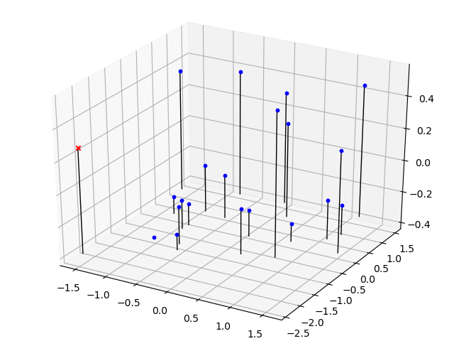

Figure 3: Camera Center in 3-D

### **Step II:**Estimation of fundamental matrix using point correspondence {#L2}

   In this section we are required to estimate the transformation of
points in one image to lines in another using fundamental matrix. The
process is same as we had in **Step I** but now we are estimating the
3x3 matrix. Also, instead of 3-D and 2-D we use dual 2-D pair to
estimate the fundamental matrix. Same as previously we can write that:

We can simplify it further as follows:

Whcih in turn results in the below equation:

Previously we propose that m\_34 is one to fix the scale of matrix. Here
we do the same and choose f\_33 to be one. If we simplify the expression
we can write the new expression as:

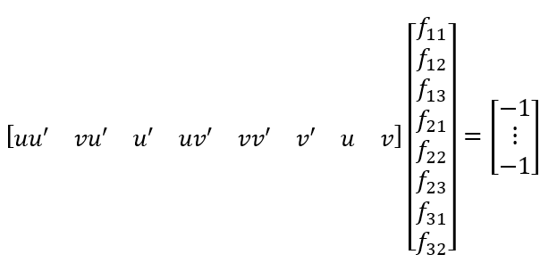

  One can find the f matrix by solving the above expression. As there
are 8 values in f matrix and we already supposed f\_33 to be one, we can
convert this column matrix into a 3x3 matrix f. Again f matrix is of
rank 2 so it can be written in term of its singular decomposed elements.

  The step II is implemented in two sub steps. First I have implemented
the routine for fundamental matrix estimation without normalizing the
points It is straight forward. Below routine gives an overview of the
algorithm described above for unnormalized points.

    Estimating Fundamental Matrix without normlization

        ###########################################################################
        ###########################################################################
        
        arr_a = np.column_stack((Points_a, [1]*Points_a.shape[0])) #adding an identity column
        arr_b = np.column_stack((Points_b, [1]*Points_b.shape[0])) #adding an identity column

        arr_a = np.tile(arr_a, 3) # Construct an array by repeating arr_a three times
        arr_b = arr_b.repeat(3, axis=1) # Repeat column elements of arr_b three times 
        A = np.multiply(arr_a, arr_b) # Element-wise multiplication 

        '''Solve f from Af=0'''
       
        U, s, V = np.linalg.svd(A) # singular value decomposition
        F_matrix = V[-1]
        F_matrix = np.reshape(F_matrix, (3, 3)) 

        '''Resolve det(F) = 0 constraint using SVD'''
        U, S, Vh = np.linalg.svd(F_matrix)
        S[-1] = 0
        F_matrix = U @ np.diagflat(S) @ Vh
        
        ###########################################################################
        ###########################################################################

   The output of unnormalized fundamental is not very promising and can
be visulaize in below figure:

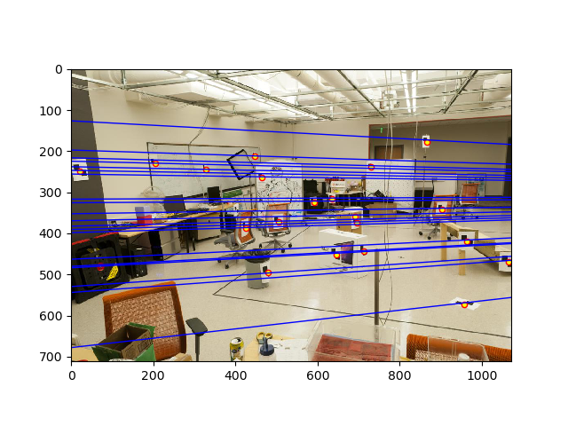

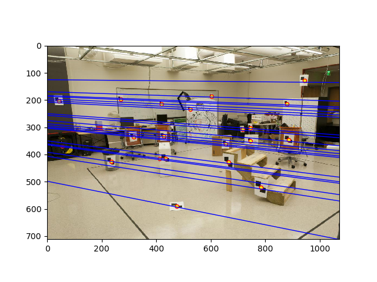

Fig 4: Epipolar lines using unnormalized points

   The below routine we perfom the second step of fundamental matrix
estimation i.e. finding the matrix for normalized point. The points are
normalized on zero mean and unity variance.

    Estimating Fundamental Matrix with normlization

        ###########################################################################
        ###########################################################################
        
        mean_a = points_a.mean(axis=0) # Calculating mean of points_a
        mean_b = points_b.mean(axis=0) # Calculating mean of points_b
        
        std_a = np.sqrt(np.mean(np.sum((points_a-mean_a)**2, axis=1), axis=0)) #  Calculating Stadard deviation of points_a
        std_b = np.sqrt(np.mean(np.sum((points_b-mean_b)**2, axis=1), axis=0)) #  Calculating Stadard deviation of points_b

        Ta1 = np.diagflat(np.array([np.sqrt(2)/std_a, np.sqrt(2)/std_a, 1]))  #  Create a two-dimensional array with the 
                                                                              #  Flattened input as a diagonal
      
        # Return a 2-D array with ones on the diagonal and zeros elsewhere.
        Ta2 = np.column_stack((np.row_stack((np.eye(2), [[0, 0]])), [-mean_a[0], -mean_a[1], 1])) 

        #  Create a two-dimensional array with the Flattened input as a diagonal
        Tb1 = np.diagflat(np.array([np.sqrt(2)/std_b, np.sqrt(2)/std_b, 1]))
        
        # Return a 2-D array with ones on the diagonal and zeros elsewhere.
        Tb2 = np.column_stack((np.row_stack((np.eye(2), [[0, 0]])), [-mean_b[0], -mean_b[1], 1]))

        Ta = np.matmul(Ta1, Ta2) # Matrix product of two arrays.
        Tb = np.matmul(Tb1, Tb2) # Matrix product of two arrays.

        arr_a = np.column_stack((points_a, [1]*points_a.shape[0])) # Adding an identity column
        arr_b = np.column_stack((points_b, [1]*points_b.shape[0])) # Adding an identity column

        arr_a = np.matmul(Ta, arr_a.T) # Matrix product of two arrays.
        arr_b = np.matmul(Tb, arr_b.T) # Matrix product of two arrays.

        arr_a = arr_a.T # Transpose of arr_a.
        arr_b = arr_b.T # Transpose of arr_b.

        arr_a = np.tile(arr_a, 3) # Construct an array by repeating arr_a three times
        arr_b = arr_b.repeat(3, axis=1)
        A = np.multiply(arr_a, arr_b)

        
        
        '''Solve f from Af=0'''
        U, s, V = np.linalg.svd(A)
        F_matrix = V[-1]
        F_matrix = np.reshape(F_matrix, (3, 3))
        F_matrix /= np.linalg.norm(F_matrix)

        '''Resolve det(F) = 0 constraint using SVD'''
        U, S, Vh = np.linalg.svd(F_matrix)
        S[-1] = 0
        F_matrix = U @ np.diagflat(S) @ Vh # matmul short form 

        F_matrix = Tb.T @ F_matrix @ Ta # matmul short form 

        ###########################################################################
        ###########################################################################

   The below figure is the output with normalized points. This picture
is evident that epipolar lines with normalized points has more quality.

Fig 5: Epipolar lines using Normalized points

  We now have completed two steps till now, first, the 3-D to 2-D
transformation matrix and second, estimation of fundamental matrix. The
next step is same but with some more computational complexity.

### **Step III:**Fundamental matrix estimation using RANSAC {#L3}

   The last part of this project is to use RANSAC and target the
computational cost using fundamental matrix. Although the SIFT pipeline
is good and may perform well but we may have errors and it is very
challenging to determine the outliers. The best fit can be achieved
using RANSAC which is random sample consensus. We have option of
choosing 8-12 correspondences of random samples. I have selected this
value to be 8 samples. Now with this random correspondence of samples
number of inliers are counted. Number of iterations are performed until
the threshold is achieved. The best fundamental matrix is chosen based
on most inliers. The threshold is set to 0.01 and number of iterations
are chosen to be 15000. Below is the code routine of with comments to
improve the readability.

    Fundamental matrix estimation using RANSAC

        ###########################################################################
        ###########################################################################
        num_iteration =15000
        number_matches=matches_b.shape[0] # Number of matches
        num_sample_rand = 8
        index_rand =np.random.randint(number_matches,size=(num_iteration,num_sample_rand)) 
        
        m=np.ones((3,number_matches)) # unity matrix
        m[0:2,:]=matches_a.T # stacking matches and identity columns for matches a
        
        mdash=np.ones((3,number_matches)) # unity matrix
        mdash[0:2,:]=matches_b.T # stacking matches and identity columns for matches b
        
        count=np.zeros(num_iteration) 
        err=np.zeros(number_matches)
        
        threshold=0.01 # Threshold value
        for i in range(num_iteration):
            
            cost1=np.zeros(8)
            
            #Finding the normalize fundamental estimation matrix (Normalized)
            F=estimate_fundamental_matrix_with_normalize(matches_a[index_rand[i,:],:]
                                                         ,matches_b[index_rand[i,:],:])
            #for each point calculate error
            for j in range(number_matches):
                err[j]=np.dot(np.dot(mdash[:,j].T,F),m[:,j])
            inlie=np.absolute(err) < threshold # only consider if error is less than the threshold 
            count[i]=np.sum(inlie + np.zeros(number_matches),axis=None)
         
        index=np.argsort(-count)
        best=index[0]
        
         #Finding the best normalize fundamental estimation matrix 
        
        best_F = estimate_fundamental_matrix_with_normalize(matches_a[index_rand[best,:],:],
                                                            matches_b[index_rand[best,:],:])
        for j in range(number_matches):
            err[j]=np.dot(np.dot(mdash[:,j].T,best_F),m[:,j])
        confidence=np.absolute(err)
        index=np.argsort(confidence)
        matches_b=matches_b[index]
        matches_a=matches_a[index]

        inliers_a=matches_a[:100,:]
        inliers_b=matches_b[:100,:]

        ###########################################################################
        ###########################################################################

  The results achived on different examples images are shown below:

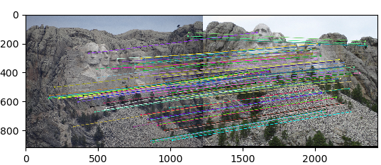 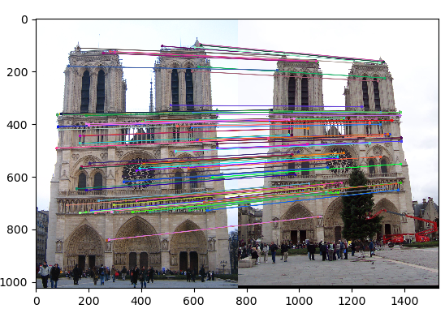 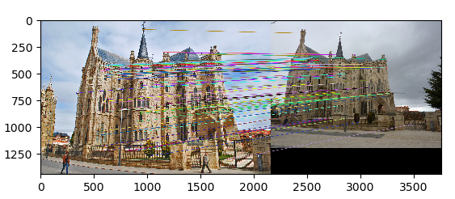 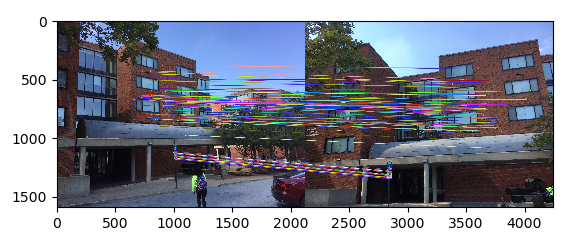

Figure 6: RANSAC Result after Normalized Fundemental Matrix

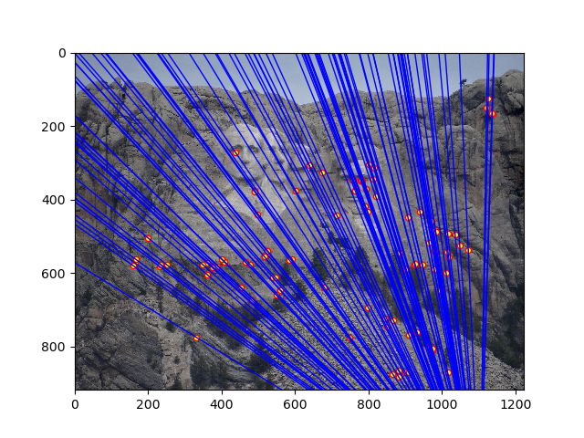

Figure 7: Epipolar lines using Normalized points and RANSAC

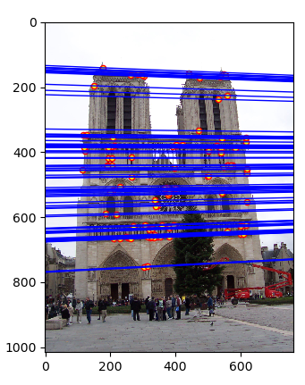

Figure 8: Epipolar lines using Normalized points and RANSAC

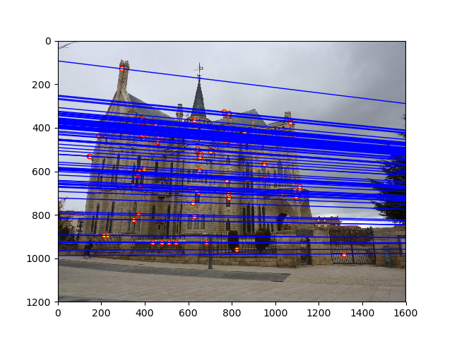

Figure 09: Epipolar lines using Normalized points and RANSAC

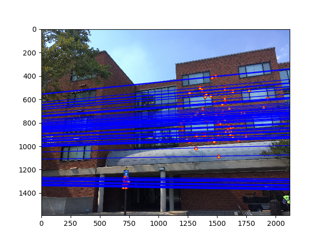

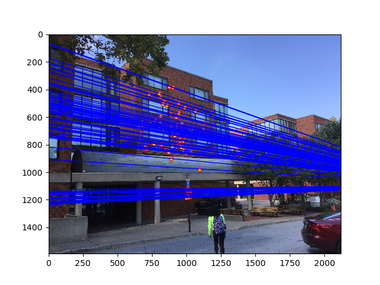

Figure 10: Epipolar lines using Normalized points and RANSAC

  Comparing Figure 2 and 3 we can see that there is less saturation of
interest points in the area with high saturation and interest points are
more evenly spreaded as compared to simple corner detector. Now that we
have our final distinct interest points the next step is to find
features.

   As evident from the figures above, visually it is difficult to
analyze what is right and what is wrong I therefor attach table to
analyze the results through accuracy mettric.

  One can see the table show promising result. This algorithm provides
best performance for Mount Rushmore image with only nine mistakes out of
hundred. On the contrary this algorithm suffers badly for Episcopal
Gaudi image. There are ways one can improve these results. One way is
using features from a scale space but not just from one scale. Also,
“Harris” corner detector is not exceptionally good way of detecting
corners using Maximum Stable External Area (MSER) may improve the
results.

### Conclusion

  To conclude, based on the visuals and math one can say that RANSAC
under normalized fundamental matrix have less outlier compared to
un-normalized. The improvement for different images is varying i.e.,
although RANSAC with normalized points does improve but there is no
answer to how much it will improve in general.

### Reference:

[1] Frahm JM, Pollefeys M. RANSAC for (quasi-) degenerate data
(QDEGSAC). In2006 IEEE Computer Society Conference on Computer Vision
and Pattern Recognition (CVPR'06) 2006 Jun 17 (Vol. 1, pp. 453-460).
IEEE.
