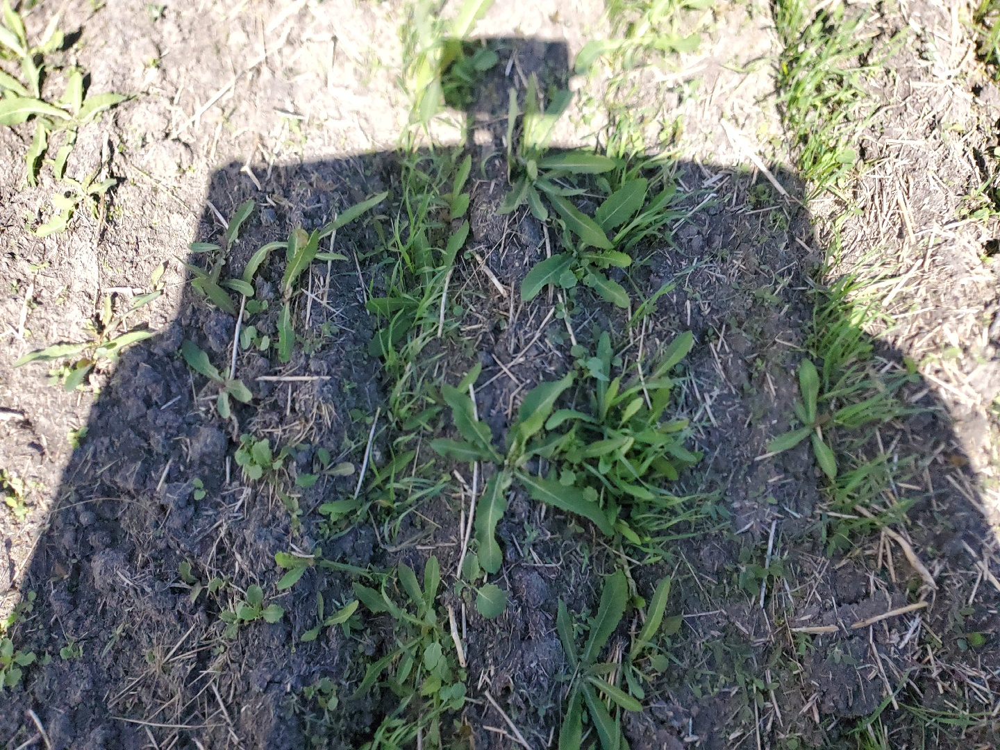

## Semantic Segmentation using Keras  : Implementation of U-Net, SegNet, DeepLabv3+, CGAN, and many other models in Keras with tensorflow backend  
From scratch implementation of multiple State-of-the-art models for Semantic Segmentation 

Following models are supported:

| model_name       | Base Model        | Segmentation Model |
|------------------|-------------------|--------------------|
| unet             | orignal           | U-Net              |
| unet_resnet      | Resnet-50         | U-Net              |
| segnet           | Simple            | SegNet             |
| segnet_resnet    |  Resnet-50        | SegNet             |
| depplabv3plus    | Resnet-50         | DeepLabV3+         |
| depplabv3plus    | VGG               | DeepLabV3+         |
| pix2pixunet      | unet              | pix2pix            |
| pix2pixunet      | segnet            | pix2pix            |
| pix2pixunet      | depplabv3+        | pix2pix            |
| Light_weight_unet| unet              | U-Net              |


Example required end results:

Input Image                |Broadleaf Weed Segmentation 
:-------------------------:|:-------------------------:
  |  
  |  

## 1. How to start?
The first step is to prepare the data, one can use [Labelme](https://github.com/wkentaro/labelme.git) software to label the images as per requirement. One can use other online tools like [Dataloop](https://dataloop.ai/solutions/data-annotation/) or [Segments.ai](https://segments.ai/) to efficiently label images and keep track of progress. Segments.ai gives an easy-to-use scheme to utilize predictions for fine tuning the model.


Installing Labelme tool:
```shell
conda create --name=labelme python=3.6
source activate labelme
# conda install -c conda-forge pyside2
# conda install pyqt
# pip install pyqt5  # pyqt5 can be installed via pip on python3
pip install labelme
# or you can install everything by conda command
# conda install labelme -c conda-forge
```
More details can be found at offical links. 

## 2. Processing Labelled data
If you are making your own dataset for a specific application, make sure to prepare a detail document having a description of the label although the above mentioned software  also provides this detail. The next step is to convert the data into categorical form (depends on loss type). The colour image (labelme will lead to a 3-channel image) will be converted to one channel representation which will then be converted to one hot encoded data.

## 3. Training the model
The next step is to initialize the segmentation model and train it for specific number of epochs. One thing to keep in mind is the input to the model, it is good idea to not overflow the memory of your system and find a suitable balance for the batch size and input dimension.

## 4. How to improve the results?
Generally, accuracy improves with respect of number of examples but labelling large number of samples is time consuming and hectic. To increase the number of examples one can perfrom augmentation. There are different types of augmentation one can use like blurring, rotation, and flipping. 

## 5. Augmentation


